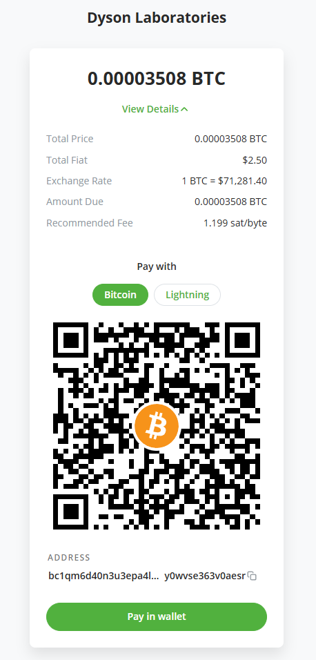

## What this looks like in practice



**Example BTCPay invoice created via `gf-sdk`.**  
USD-denominated invoice created programmatically, with settlement verified by the SCRAP portal.

## Documentation

Most user-facing documentation for the SDK lives under:

- [SDK Documentation](packages/gf-sdk/docs)

Key guides:
- [Treasury & Conversion Guide](packages/gf-sdk/docs/Treasury%20%26%20Conversion%20Guide.md)


# gf-sdk Monorepo

Quick start: see examples/create-invoice/example.ts to generate your first invoice (no admin token required).

The SCRAP Portal runs on a remote VPS only (170.75.173.239). Local portal execution is not supported.
Production uses baseUrl `https://btcpay.dyson-labs.com` with apiPrefix `/portal`.
Integration tests require `GF_PORTAL_BASE_URL` and will skip unless it is set.
`/portal-staging` is not currently exposed; staging is TBD unless explicitly provided.

Known-good env (production):

```text
GF_PORTAL_BASE_URL=https://btcpay.dyson-labs.com
GF_PORTAL_API_PREFIX=/portal
GF_PORTAL_V1_PREFIX=/v1
```

`PORTAL_ADMIN_TOKEN` is only required for admin-only dispatch and legacy exec.

This repo is split into two packages:

- `packages/gf-sdk` � public SCRAP Portal SDK for integrators (PortalClient only)
- `packages/gf-tools` � internal tooling and simulation helpers (BTCPay-direct, dev scripts)

## Workspace commands

```
pnpm install
pnpm build
pnpm test
pnpm lint
```

## Package commands

```
pnpm -C packages/gf-sdk build
pnpm -C packages/gf-sdk portal:health
pnpm -C packages/gf-sdk smoke

pnpm -C packages/gf-tools btcpay:create-invoice
```

## Migration note

If you previously used BTCPay-direct helpers from `gf-sdk`, they have moved to `packages/gf-tools`.
The public SDK now targets the SCRAP Portal only.
